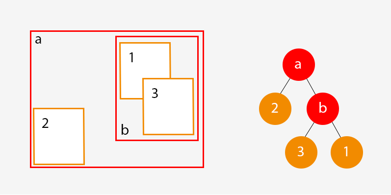

I am Joan Marín, student of the Bachelor’s Degree in Video Games by UPC at CITM. This content is generated for the second year’s subject Project 2, under supervision of lecturer Ricard Pillosu.
 
Introduction
Something I like about coding, is that every task can be approached and solved in different ways.
 
In video games, when we want to check collisions, render tile maps, render 3D objects, etc. the first solutions that comes to our mind will usually be an exhaustive search, also called brute force search.
 
As its name says, this algorithms are generally problem-solving, but they scale with the size of candidates they have to check., working OK with a low amount of them but making our game unplayable if the amount is high.
 
For example, in order to check the collisions of the particles of the system in the image, if we used a brute force algorithm, we would check each particlie colliding with the others, no matter their position.

If we are working with a low amount of particles like in this image, we would iterate 72 (8x8) times each frame. But let’s say we are working with 100 particles, we would need 10.000 (100x100) iterations each frame.

 
 
Now imagine how many iterations we would need in a scene like this one:

 

And that’s where spacial partitioning appears and saves us.

# Space partitioning

In order to avoid iterations that are not needed (colliders too far from each other, tiles / polygons out of the screen), we can divide the space into different subsets.
 
That process is called space partition. There are a lot of ways to divide the space, and depending on our needs we will choose one or another.
 
* **Quadtrees**: divides the space into 4 equal subsets, each of them might be divided into 4 subsets, etc.

 

* **Octrees**: similar to the quadtrees, but used in 3D instead of 2D. Each node will have 8 children instead of 4.

 

* **k-d trees**: the space is divided into 2 subspaces, which might not be equal. The “partition lines” are always perpendicular to the coordinates axis.

 

* **AABB Trees**: Creates subspaces for each group of elements we need to check. Mostly used in dynamic entities like collisions.
 
  
 
This are just a few ways to part the space explained superficially. There are a lot more of them and honestly, we could spend an entire semester talking about different space partition data structures, but in this article I’m going to focus on Quadtrees.
 
 
 
# Quadtrees

As I said before, quadtrees are a data structure that divide the space into 4 sub regions (we can talk about nodes and subnodes). 

